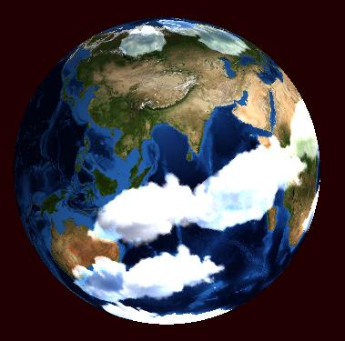
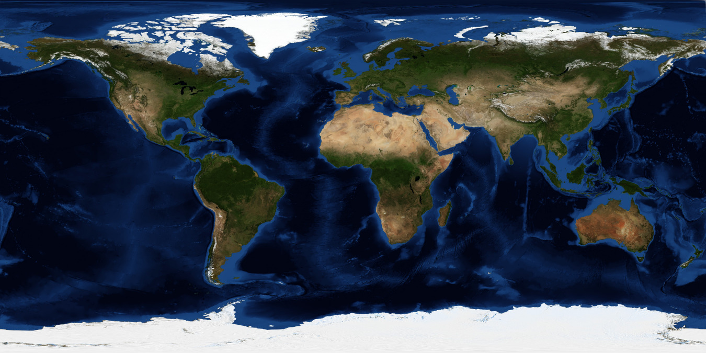

Rotating planet with a shader in Ebiten



This is a simple example of how to use a shader in Ebiten to create a rotating planet effect. The shader takes as input a texture of a planet, which must be in equirectangular format (a rectangular image that can be mapped onto a sphere). Here is the earth image:



For each pixel that the shader renders it does the following things:
1. Convert pixel coordinate to normalized texture coordinate in the range [-1, 1]
2. Convert the normalized texture coordinate to a 3D point on the unit sphere
3. Rotate the 3D point around an axis (a 3D vector) by an angle (in radians) that changes over time
4. Convert the rotated 3D point back to a normalized texture coordinate
5. Convert the normalized texture coordinate to a pixel coordinate in the input texture

And for good measure, apply a simple lighting effect to the pixel value. The planet rotates because in step 3 the angle changes over time, based on the number of ticks the engine has executed for.

Clouds are also drawn on top of the planet, which uses the same exact renderer as the planet but with a smaller angle to make the clouds rotate slower than the planet, and also with a blend setting to make the clouds semi-transparent. The cloud texture is created by creating a new image the same size as the planet texture, and copying small cloud images onto it at random positions.

A walkthrough of the shader code:

```
func Fragment(position vec4, texCoord vec2, color vec4) vec4 {
	// Normalize screen coords to [-1, 1]
    resolution := imageSrc0Size()
    uv := (texCoord - imageSrc0Origin()) / resolution
```
The entry point to the shader. The first thing it does is convert the input texture coordinates (in pixels) to a normalized uv coordinate in the range [0, 1]. Note that in ebiten the texture might be on a much larger atlas texture, so we need to subtract the origin of the texture in the atlas and divide by the size of the texture to get the correct uv coordinates.

```
    // convert from [0-1] to [-1, 1]
	p := uv*2.0 - 1.0

	// Correct aspect ratio
	p.x *= resolution.x / resolution.y
```
Then we perform a small adjustment to convert the uv coordinates from [0, 1] to [-1, 1], and also correct for the aspect ratio of the texture. This is necessary because we want to map the texture onto a unit sphere, which is perfectly circular, but if the texture is not square then we need to adjust the x coordinate to account for the aspect ratio.

```
	// Sphere mask. Get the magnitude of the p vector
	r2 := dot(p, p)
    // if the magnitude is larger than the unit circle then this point lies outside
    // the sphere
	if r2 > 1.0 {
		return vec4(0.0, 0.0, 0.0, 0.0)
	}
```
Since the shader draws a rectangle but we only want to draw a circle (the planet), we can use the magnitude of the p vector to determine if the current pixel lies outside the unit circle. If it does, we return a transparent color and skip the rest of the shader.

```
	// Reconstruct sphere normal
	z := sqrt(1.0 - r2)
	n := normalize(vec3(p.x, p.y, z))
```
Now we can reconstruct the normal vector of the sphere at this point. Since we know that the point lies on the surface of a unit sphere, we can use the p coordinates as the x and y components of the normal, and then calculate the z component using the equation of a sphere (x^2 + y^2 + z^2 = 1). We also normalize the normal vector just to be safe. Note that a pixel in the middle of the sphere will have an r2 value of 0, which means the z component will be 1 and the normal will point straight out towards the camera. A pixel near the edge of the sphere will have an r2 value close to 1, which means the z component will be close to 0 and the normal will point more towards the side.

The `n` 3d vector represents the pixel on the sphere that we want to rotate.

```
    axis := normalize(Axis)

	// Animate rotation
	rotated := rotateAroundAxis(n, axis, Rotation)
```
At the top of the shader are two input uniforms: Rotation and Axis. Rotation is a float that changes over time to create the animation effect, and Axis is a vec3 that determines the axis of rotation. We normalize the axis just to be safe, and then we use the rotateAroundAxis function (which implements Rodrigues' rotation formula) to rotate the normal vector around the specified axis by the specified angle. Here is a good explainer video on how the formula is derived: https://www.youtube.com/watch?v=CQSC5W5bPXQ

The implementation of rotateAroundAxis basically just follows that video, and is shown here for reference:
```
// Rodrigues' rotation formula
// https://www.youtube.com/watch?v=CQSC5W5bPXQ
func rotateAroundAxis(v vec3, axis vec3, angle float) vec3 {
	c := cos(angle)
	s := sin(angle)

	return v*c +
		cross(axis, v)*s +
		axis*dot(axis, v)*(1.0 - c)
}
```

```
	// Convert to UV for texture lookup
    // UV coordinates are back in [0-1] range
	sphereUV := dirToUV(rotated)
```
Use another helper function to convert the rotated 3d point back to UV coordinates for texture lookup. The dirToUV function is shown here for reference:
```
const PI = 3.141592653589793

// Convert direction vector -> spherical UV
func dirToUV(d vec3) vec2 {
	u := atan2(d.z, d.x)/(2.0*PI) + 0.5
	v := asin(d.y)/PI + 0.5
	return vec2(u, v)
}
```
This formula can also be seen on the wikipedia page: https://en.wikipedia.org/wiki/UV_mapping

```
    sphereUV.x = fract(sphereUV.x)
    sphereUV.y = clamp(sphereUV.y, 0.0, 1.0)

    // convert back to UV coordinates
    pos := sphereUV.xy * resolution.xy
```
Convert the texture coordinates back to pixel coordinates for texture lookup. We also use the fract function to wrap the x coordinate around, since the texture is repeated horizontally (equirectangular format), and we clamp the y coordinate to [0, 1] just to be safe.
```

```
	// Sample texture. Add offset as well to account for ebiten atlas
	col := imageSrc0At(pos + imageSrc0Origin())
```
Look up the pixel value from the texture given the calculated pixel coordinates. We also need to add the origin of the texture in the atlas to get the correct coordinates.

```
    // Simple lighting (fake sun from top-right)
    // TODO: make lighting vector an input
	lightDir := normalize(vec3(0.5, 0.5, 1.0))
	diff := clamp(dot(rotated, lightDir), 0.0, 1.0)

	// Add a bit of ambient
	lighting := diff*0.8 + 0.8
```
Perform a simple lighting computation by taking the dot product of the rotated normal vector with a fixed light direction (which is coming from the top-right in this case). We also add a bit of ambient lighting to make sure the planet is not completely dark on the side facing away from the light.

```
	return vec4(col.rgb * lighting, 1.0)
```
The final pixel value is the color from the texture multiplied by the lighting factor, with an alpha of 1.0 (fully opaque).

This shader is invoked from ebiten like so:
```
    rotationSpeed := counter / 600.0

    opts.Uniforms = map[string]interface{}{
        "Rotation":       float32(rotationSpeed),
        "Axis": []float32{axis.X, axis.Y, axis.Z},
    }
    opts.Images[0] = planetImage

    screen.DrawRectShader(w, h, shader, opts)
```
Where `counter` is a variable that increments every tick, and `axis` is a 3D vector that determines the axis of rotation. The planet image is passed in as the first texture (imageSrc0) for the shader to use. The shader is then drawn onto the screen using the DrawRectShader function, which applies the shader to a rectangle that covers the entire screen. See the `draw` function in main.go for more arguments, and how the sphere is positioned on the screen using the GeoM in the DrawRectShader options.
